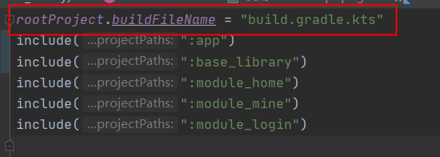
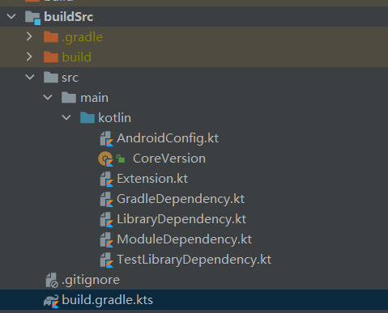
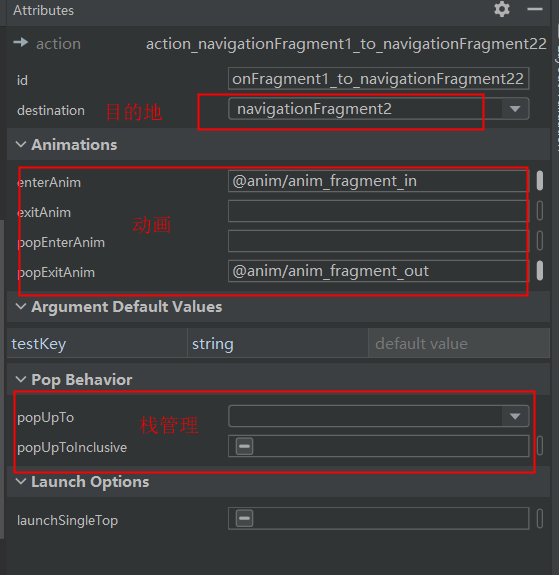
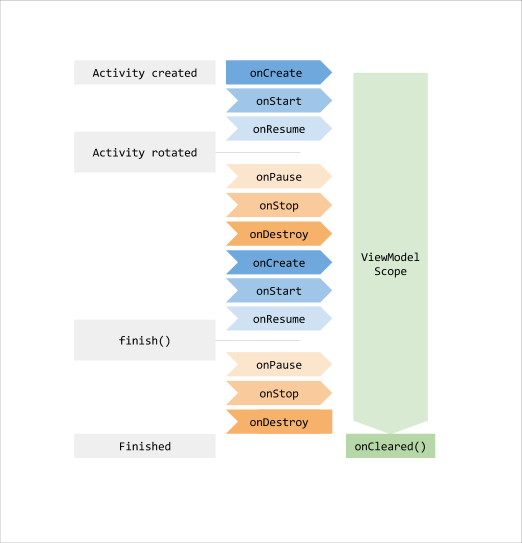
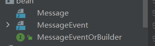
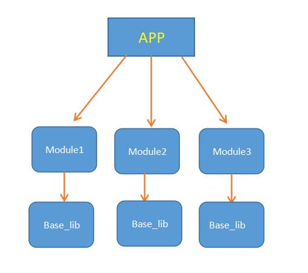
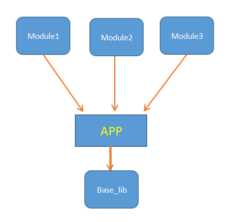

# 基于Kotlin+Jetpack+MVVM实现组件化应用的一种思路

作者：海坤


## 100% kotlin

### 为什么使用kotlin
* 富有表现力且简洁：您可以使用更少的代码实现更多的功能。**表达自己的想法**，少编写样板代码。在使用 Kotlin 的专业开发者中，有 67% 的人反映其工作效率有所提高。
* 更安全的代码：Kotlin 有许多语言功能，可帮助您避免 null 指针异常等常见编程错误。包含 Kotlin 代码的 Android 应用发生崩溃的可能性降低了 **20%**。
* 可互操作：您可以在 Kotlin 代码中调用 Java 代码，或者在 Java 代码中调用 Kotlin 代码。Kotlin 可完全与 Java 编程语言互操作，因此您可以根据需要在项目中添加任意数量的 Kotlin 代码。
* 结构化并发：Kotlin 协程让异步代码像阻塞代码一样易于使用。协程可大幅简化后台任务管理，例如网络调用、本地数据访问等任务的管理。
* 空判断、方法/属性扩展、属性委托、高阶函数、DSL语法糖、协程、默认参数等等
* 虽然谷歌承诺永远不会放弃对Java的支持，但是新的compose必须要使用kotlin，虽然Java也可以实现，但是不容易实现，而不容易实现往往就意味着“无法实现”
* **真香！**

## 使用Kotlin Script+buildSrc编写构建脚本
目前我们使用Gradle构建语言是Groovy，但是Gradle实际上是支持Kotlin来编写Gradle构建脚本的，常见的构建脚本是.gradle结尾，而Koltin语法编写的脚本则是.gradle.kts，使用kotlin构建脚本的好处是可以有代码提示，和写一些扩展方法。  
同时，我们可以使用buildSrc进行版本管理。

### 使用Kotlin Script
* 方式一（新项目）：
使用最新的Canary版本Android studio，新建项目的时候勾选Use Kotlin script(.kts) for Gradle build files


* 方式二：
将项目中所有.gradle文件改为.gradle.kts，同时修改内容语法为kotlin script语法（具体不展开，可以参照demo），包括settings.gradle,然后在settings.gradle.kts加上

```
rootProject.buildFileName = "build.gradle.kts" 
```


### 使用buildSrc
* 新建一个Android library，名字**必须为buildSrc**，创建之后会报这个名字的module已经存在，因为这个名字是保留名字，所以去setting.gradle中删掉include
buildSrc那一行即可。

* buildSrc目录文件目录如下



* buildSrc 中 build.gradle.kts内容

```
plugins {
    `kotlin-dsl`
}

repositories {
    google()
    mavenCentral()
}
```
* 然后就可以像下面这样引用


## Android Jetpack
Jetpack 是一个由多个库组成的套件，可帮助开发者遵循最佳做法，减少样板代码并编写可在各种 Android 版本和设备中一致运行的代码，让开发者精力集中编写重要的代码

### 导航 [navigation](https://developer.android.google.cn/guide/navigation)
navigation是一个框架，用于在 Android 应用中的“目标位置”之间导航,Android Jetpack的导航组件可帮助您实现导航，无论是简单的按钮点击，还是应用栏和抽屉式导航栏等更为复杂的模式，该组件均可应对。导航组件还通过遵循一套既定原则来确保一致且可预测的用户体验。导航组件由以下三个关键部分组成：
* 导航图：在一个集中位置包含所有导航相关信息的 XML 资源。这包括应用内所有单个内容区域（称为目标）以及用户可以通过应用获取的可能路径。
* NavHost：显示导航图中目标的空白容器。导航组件包含一个默认 NavHost 实现 (NavHostFragment)，可显示 Fragment 目标。
* NavController：在 NavHost 中管理应用导航的对象。当用户在整个应用中移动时，NavController 会安排 NavHost 中目标内容的交换。

#### navigation 依赖
* app依赖
```
implementation "androidx.navigation:navigation-fragment-ktx:$nav_version"
implementation "androidx.navigation:navigation-ui-ktx:$nav_version"
implementation "androidx.navigation:navigation-dynamic-features-fragment:$nav_version"
```
* 如果要使用Safe Args传递安全参数， 要在 **项目build.gradle** 文件中包含以下 classpath
```
buildscript {
    repositories {
        google()
    }
    dependencies {
        def nav_version = "2.3.4"
        classpath "androidx.navigation:navigation-safe-args-gradle-plugin:$nav_version"
    }
}
```

此外还需要在应用模块build.gradle添加

```
apply plugin: "androidx.navigation.safeargs.kotlin"
```
#### NavHost:

* NavigationActivity

```
class NavigationActivity: AppCompatActivity(R.layout.activity_navigation)
```
* activity_navigation
```
<?xml version="1.0" encoding="utf-8"?>
<LinearLayout xmlns:android="http://schemas.android.com/apk/res/android"
    xmlns:app="http://schemas.android.com/apk/res-auto"
    android:layout_width="match_parent"
    android:layout_height="match_parent"
    android:orientation="vertical">

    <fragment
        android:id="@+id/navHostFragment"
        android:name="androidx.navigation.fragment.NavHostFragment"
        android:layout_width="match_parent"
        android:layout_height="match_parent"
        app:defaultNavHost="true"
        app:layout_constraintBottom_toTopOf="@id/navView"
        app:layout_constraintLeft_toLeftOf="parent"
        app:layout_constraintRight_toRightOf="parent"
        app:layout_constraintTop_toTopOf="parent"
        app:navGraph="@navigation/navigation_demo_navigation" />
</LinearLayout>
```
android:name="androidx.navigation.fragment.NavHostFragment"这是依赖包中的fragment，作用是定义整个导航的起始

设置app:defaultNavHost="true"，就会拦截系统的返回按钮，这时切换fragment会默认进行入栈

navGraph引用定义好的导航文件

#### 导航图

* res/navigation/navigation_demo_navigation.xml

<?xml version="1.0" encoding="utf-8"?>
<navigation xmlns:android="http://schemas.android.com/apk/res/android"
    xmlns:app="http://schemas.android.com/apk/res-auto"
    android:id="@+id/navigation_demo_navigation"
    app:startDestination="@id/navigationFragment1">
    <!--startDestination 初始目的地-->
    <fragment
        android:id="@+id/navigationFragment1"
        android:name="com.haikun.jetpackapp.home.ui.demo.navigation.NavigationFragment1"
        android:label="NavigationFragment1">
        <action
            android:id="@+id/action_navigationFragment1_to_navigationFragment2"
            app:destination="@id/navigationFragment2" />

        <action
            android:id="@+id/action_navigationFragment1_to_navigationFragment22"
            app:destination="@id/navigationFragment2"
            app:enterAnim="@anim/anim_fragment_in"
            app:popExitAnim="@anim/anim_fragment_out" />
        <!--action 跳转动作-->
        <!--enterAnim popExitAnim 指定动画-->
    </fragment>

    <fragment
        android:id="@+id/navigationFragment2"
        android:name="com.haikun.jetpackapp.home.ui.demo.navigation.NavigationFragment2"
        android:label="NavigationFragment2">
        <argument
            android:name="testKey"
            app:argType="string"
            app:nullable="true" />
        <!--argument 接收的参数-->
        <action
            android:id="@+id/action_navigationFragment2_to_navigationFragment3"
            app:destination="@id/navigationFragment3"
            app:enterAnim="@anim/anim_fragment_in"
            app:popExitAnim="@anim/anim_fragment_out" />
    </fragment>

    <fragment
        android:id="@+id/navigationFragment3"
        android:name="com.haikun.jetpackapp.home.ui.demo.navigation.NavigationFragment3"
        android:label="NavigationFragment3">
        <action
            android:id="@+id/action_navigationFragment3_to_navigationFragment1"
            app:destination="@id/navigationFragment1"
            app:popUpTo="@id/navigationFragment1"
            app:popUpToInclusive="true" />
        <!--app:popUpTo 会从堆栈中移除 2 和 3-->
        <!--app:popUpToInclusive="true" 还会将第一个 1 从堆栈上弹出，从而有效地清除它-->
    </fragment>
</navigation>

* 还可以切换到Design模式编辑




#### NavController

* 在fragment1中直接调用以下代码即可从fragment1切换到fragment2，并且传入参数

```
findNavController().navigate(NavigationFragment1Directions.actionNavigationFragment1ToNavigationFragment22("测试"))
```

#### 其他功能
* 全局操作 使用全局操作来创建可由多个目的地共用的通用操作
* 创建深层链接 将用户直接转到应用内特定目的地的链接
* 使用 NavigationUI 更新界面组件 使用顶部应用栏、抽屉式导航栏和底部导航栏来管理导航
* 自定义返回导航

### [Lifecycle](https://developer.android.google.cn/topic/libraries/architecture/lifecycle?hl=zh_cn)

#### 传统在生命周期方法写逻辑代码的缺点
* 太多管理界面和其他组件的调用，以响应生命周期的当前状态。管理多个组件会在生命周期方法（如 onStart() 和 onStop()）中放置大量的代码，这使得它们难以维护
* 无法保证组件会在 Activity 或 Fragment 停止之前启动。在我们需要执行长时间运行的操作（如 onStart() 中的某种配置检查）时尤其如此

#### Lifecycle的优势

* 生命周期感知型组件可执行操作来响应另一个组件（如 Activity 和 Fragment）的生命周期状态的变化。这些组件有助于您编写出更有条理且往往更精简的代码，您可以将依赖组件的代码从生命周期方法移入组件本身中，此类代码更易于维护。

#### lifecycle使用

* 定义LifecycleObserver
```
inner class MyLifecycleObserver(val lifecycle: Lifecycle) : LifecycleObserver {

        @OnLifecycleEvent(Lifecycle.Event.ON_START)
        fun onStart() {
            CoroutineScope(scope).launch {
                delay(3000)
                if (lifecycle.currentState.isAtLeast(Lifecycle.State.STARTED)) {
                    LogUtil.e("开启定位")
                }
            }
        }

        @OnLifecycleEvent(Lifecycle.Event.ON_STOP)
        fun onStop() {
            LogUtil.e("关闭定位")
        }
    }
```

* 添加LifecycleObserver
```
override fun onCreate(savedInstanceState: Bundle?) {
    super.onCreate(savedInstanceState)
    lifecycle.addObserver(MyLifecycleObserver(lifecycle))
}
```

### [ViewModel](https://developer.android.google.cn/topic/libraries/architecture/viewmodel?hl=zh_cn)

* 旨在以注重生命周期的方式存储和管理界面相关的数据。ViewModel 类让数据可在发生屏幕旋转等配置更改后继续留存，负责为界面准备数据。在配置更改期间会自动保留 ViewModel 对象，以便它们存储的数据立即可供下一个 Activity 或 Fragment 实例使用。

#### ViewModel可以解决什么问题

* 如果系统销毁或重新创建界面控制器，则存储在其中的任何瞬态界面相关数据都会丢失，为了避免我们的程序出现上述这种情况，我们除了使用Activity的savedInstanceState(仅适合可以序列化再反序列化的少量数据)保存数据之外，还可以使用ViewModel来进行处理数据(可保存较大数据)
* 简化资源管理工作，避免内存泄漏风险，Activity 和 Fragment经常需要进行可能需要一些时间才能返回的异步调用（如网络请求），我们需要确保系统在其销毁后清理这些调用以避免潜在的内存泄漏，同时如果配置发生更改重新创建对象的时候可能会发生重复此前已完成的工作，造成资源浪费
* 让 Activity 和 Fragment 专注于界面显示，如果要求界面控制器也负责从数据库或网络加载数据，那么会使类越发膨胀，ViewModel可以更容易、高效的分离出视图数据操作
* 实现Fragment和Activity/Fragment共享数据

#### ViewModel使用

* 实现ViewModel，继承ViewModel抽象类即可
```
class ViewModelViewModel: ViewModel() {
    val userList = mutableListOf<User>()
}
```

* 引用ViewModel

在fragment/activity中使用
```
val viewModel:ViewModelViewModel by viewModels()
viewModel.userList
```

在多个fragment中共享的ViewModel，使用by activityViewModels()创建的ViewModel依赖于Activity，在多个Fragment为同一个对象
```
val shareViewModel:ViewModelViewModel by activityViewModels()
```

或者使用koin依赖注入,koin使用说明在下文
```
val viewModel: ViewModelViewModel by viewModel()

val viewModel: ViewModelViewModel by sharedViewModel()
```
#### ViewModel生命周期



### 生命周期感知数据 [LiveData](https://developer.android.google.cn/topic/libraries/architecture/livedata?hl=zh_cn)
是一种可观察的数据存储器类。与常规的可观察类不同，LiveData 具有生命周期感知能力，意指它遵循其他应用组件（如 Activity、Fragment 或 Service）的生命周期。这种感知能力可确保 LiveData 仅更新处于活跃生命周期状态的应用组件观察者。

#### LiveData的优势
* **确保界面符合数据状态**:LiveData 遵循观察者模式。当底层数据发生变化时，LiveData 会通知 Observer 对象。您可以整合代码以在这些 Observer 对象中更新界面。
* **不会发生内存泄漏**:观察者会绑定到 Lifecycle 对象，并在其关联的生命周期遭到销毁后进行自我清理。
* **不会因 Activity 停止而导致崩溃**:如果观察者的生命周期处于非活跃状态（如返回栈中的 Activity），则它不会接收任何 LiveData 事件。
* **不再需要手动处理生命周期**:界面组件只是观察相关数据，不会停止或恢复观察。LiveData 将自动管理所有这些操作，因为它在观察时可以感知相关的生命周期状态变化。
* **数据始终保持最新状态**:如果生命周期变为非活跃状态，它会在再次变为活跃状态时接收最新的数据。
* **适当的配置更改**:如果由于配置更改（如设备旋转）而重新创建了 Activity 或 Fragment，它会立即接收最新的可用数据。
* **共享资源**:可以使用单例模式扩展 LiveData 对象以封装系统服务，以便在应用中共享它们。

#### LiveData使用

* 定义
```
private val normaLiveData1 = MutableLiveData<String>()
```

* 赋值
```
normaLiveData1.value="LiveDataValue"//UI线程
normaLiveData1.postValue("LiveDataValue")//非UI主线程
```

* 观察数据

```
normaLiveData1.observe(viewLifecycleOwner, Observer {
     LogUtil.e("观察到第一个值发生了变化")
     tv.text = it
})
```

* 无生命周期感知地观察数据，这种方式需要手动取消观察，否则会发生内存泄漏
```
val observer=Observer<String>{
    LogUtil.e("观察到第一个值发生了变化")
}
normaLiveData1.observeForever(observer)
//在合适的生命周期移除观察
normaLiveData1.removeObserver(observer)
```
* 转换 LiveData
```
private val transLiveData= Transformations.map(normaLiveData1){
    "$it -----转换"
}
```
* 合并多个 LiveData
```
private val mediatorLiveData = MediatorLiveData<String>()

mediatorLiveData.addSource(normaLiveData1){
     mediatorLiveData.value="合并后的值：$it---${normaLiveData2.value}"
}

mediatorLiveData.addSource(normaLiveData2){
     mediatorLiveData.value="合并后的值：${normaLiveData1.value}---$it"
}
```
* LiveData结合room、协程使用(下文)

### kotlin数据流 [Flow](https://developer.android.google.cn/kotlin/flow?hl=zh_cn)
Flow数据流以协程为基础构建，可提供多个值。从概念上来讲，数据流是可通过异步方式进行计算处理的一组数据序列,有点像RxJava。

#### Flow的使用

* 创建Flow
```
val flow = flow<String> {
    emit("value1")
    emit("value2")
    delay(1000)
    emit("value3")
}
```
```
val flow = flowOf("value")
```
```
val flow = listOf(1, 2, 3).asFlow()
```

* 收集Flow----collect()
由于 collect 是挂起函数，因此需要在协程中执行
```
scope.launch {
    flow.collect {
        LogUtil.e(it)
    }   
}
```
* 转换Flow----map()
```
flowOf(1, 2, 3).map {
    "第$it 个"
}.collect {
    LogUtil.e(it)
}
```
* 过滤Flow----filter()
```
flowOf(1, 2, 3).filter {
     it > 1
}.collect {
     LogUtil.e(it)
}
```
* 合并Flow

**zip**操作符会把 flow1 中的一个 item 和 flow2 中对应的一个 item 进行合并,如果 flow1 中 item 个数大于 flow2 中 item 个数,合并后新的 flow 的 item 个数 = 较小的 flow 的 item 个数
```
val flow1 = flowOf(1, 2, 3, 4, 5)
val flow2 = flowOf("一", "二", "三", "四", "五", "六")
flow1.zip(flow2) { a, b ->
    "$a---$b"
}.collect {
    LogUtil.e(it)
}
```
**combine**合并时，每次从 flow1 发出新的 item ，会将其与 flow2 的最新的 item 合并
```
val flow1 = flowOf(1, 2, 3, 4, 5).onEach { delay(1000) }
val flow2 = flowOf("一", "二", "三", "四", "五", "六").onEach { delay(500) }
flow1.combine(flow2) { a, b ->
    "$a---$b"
}.collect {
    LogUtil.e(it)
}
```
* 捕获异常----catch()
```
flow {
   emit(1)
   emit(1 / 0)
   emit(2)
}.catch {
   it.printStackTrace()
}.collect {
   LogUtil.e(it)
}
```
* 线程切换----flowOn()
```
withContext(Dispatchers.IO){
    flowOf(1, 2, 3, 4).onEach {
        //受到下面最近的flowOn控制-Main
        LogUtil.e("init---${Thread.currentThread().name}")
    }.filter {
        //受到下面最近的flowOn控制-Main
        LogUtil.e("filter---${Thread.currentThread().name}")
        it > 1
    }.flowOn(Dispatchers.Main).map {
        //受到下面最近的flowOn控制-IO
        LogUtil.e("map---${Thread.currentThread().name}")
        "第$it"
    }.flowOn(Dispatchers.IO).map {
        //受到下面最近的flowOn控制-Main
        LogUtil.e("第二次map---${Thread.currentThread().name}")
        "$it 个结果"
    }.flowOn(Dispatchers.Main).collect {
        //collect要看整个flow处于哪个线程，此处为IO
        LogUtil.e("collect---${Thread.currentThread().name}")
        LogUtil.e(it)
    }
}
```
* 转为liveData----asLiveData()
添加依赖
```
"androidx.lifecycle:lifecycle-livedata-ktx:${LibraryVersion.LIVEDATA_KTX}"
```

```
flowOf(1, 2, 3, 4).asLiveData().observe(viewLifecycleOwner, Observer {
   LogUtil.e(it)
})
```
[更多操作符](https://kotlin.github.io/kotlinx.coroutines/kotlinx-coroutines-core/kotlinx.coroutines.flow/-flow/)

### 本地保存 [DataStore](https://developer.android.google.cn/topic/libraries/architecture/datastore)
DataStore 是一种数据存储解决方案,允许您使用协议缓冲区存储键值对或类型化对象。DataStore 使用 Kotlin 协程和 Flow 以异步、一致的事务方式存储数据。
[参考鸿洋的公众号内容](https://mp.weixin.qq.com/s/VYLOAYcnfUqPcfMjQPp3ow)
#### SharedPreferences存在的问题
* 通过 getXXX() 方法获取数据，可能会导致主线程阻塞
* SharedPreference 不能保证类型安全
* SharedPreference 加载的数据会一直留在内存中，浪费内存
* apply() 方法虽然是异步的，可能会发生 ANR，在 8.0 之前和 8.0 之后实现各不相同
* apply() 方法无法获取到操作成功或者失败的结果
#### DataStore 解决了什么问题
* DataStore 是基于 Flow 实现的，所以保证了在主线程的安全性
* 以事务方式处理更新数据，事务有四大特性（原子性、一致性、 隔离性、持久性）
* 没有 apply() 和 commit() 等等数据持久的方法
* 自动完成 SharedPreferences 迁移到 DataStore，保证数据一致性，不会造成数据损坏
* 可以监听到操作成功或者失败结果
* 另外 Jetpack DataStore 提供了 Proto DataStore 方式，用于存储类的对象（typed objects ），通过 protocol buffers 将对象序列化存储在本地，protocol buffers 现在已经应用的非常广泛，无论是微信还是阿里等等大厂都在使用

#### DataStore使用
添加依赖
```
const val DATA_STORE = "1.0.0-alpha05"
const val PROTOBUF = "3.11.0"
"androidx.datastore:datastore-preferences:${LibraryVersion.DATA_STORE}"
//protobuf需下面的依赖
"androidx.datastore::datastore-core:${LibraryVersion.DATA_STORE}"
"com.google.protobuf:protobuf-java:${LibraryVersion.PROTOBUF}"
```
##### 保存键值对
```
object DataStore {

    private const val APP_DATA_STORE_NAME = "APP_DATA_STORE_NAME"
    private lateinit var dataStore: DataStore<Preferences>

    fun init(context: Context) {
        dataStore = context.createDataStore(APP_DATA_STORE_NAME)
    }

    suspend fun <T> save(key: Preferences.Key<T>, value: T) {
        dataStore.edit {
            it[key] = value
        }
    }

    suspend fun <T> get(key: Preferences.Key<T>): T? {
        val value = dataStore.data.map {
            it[key]
        }
        return value.first()
    }

}
```
保存
```
CoroutineScope(scope).launch {
    DataStore.save(preferencesKey("key1"), "aa")
}
```
读取
```
CoroutineScope(scope).launch {
    val get = DataStore.get<String>(preferencesKey("key1"))
}
```
##### 保存protobuf
protobuf相关知识不在这里展开叙述

* 定义.proto文件
```
syntax = "proto3";

option java_package = "com.haikun.jetpackapp.home.ui.demo.datastore.bean";
option java_multiple_files = true;

message MessageEvent {
  int32 type = 1;
  string message = 2;
}
```
* 编译文件
编译后得到下图三个文件


* 定义Serializer
```
object MessageSerializer : Serializer<MessageEvent> {
    override val defaultValue: MessageEvent
        get() = MessageEvent.getDefaultInstance()

    override fun readFrom(input: InputStream): MessageEvent {
        return MessageEvent.parseFrom(input)
    }

    override fun writeTo(t: MessageEvent, output: OutputStream) {
        t.writeTo(output)
    }
}
```
* 保存
```
val createDataStore = context?.createDataStore("data", MessageSerializer)
createDataStore?.updateData {
     it.toBuilder().setType(12).setMessage("消息").build()
}
```
* 读取
```
CoroutineScope(scope).launch {
    context?.createDataStore("data", MessageSerializer)?.data?.first()?.let {
         LogUtil.e("${it.type}---${it.message}")
    }
}
```
### 声明式UI [DataBinding](https://developer.android.google.cn/topic/libraries/data-binding)
数据绑定库是一种支持库，借助该库，您可以使用声明性格式（而非程序化地）将布局中的界面组件绑定到应用中的数据源,***可以使用 LiveData 对象作为数据绑定来源，自动将数据变化通知给界面*** 。

#### 声明式UI  VS  命令式UI

* ***声明式UI*** 只需要把界面给「声明」出来，而不需要手动更新，只要声明的数据发生了变化，UI就跟着变化

* ***命令式UI*** 需要主动让UI更新，比如setText()

#### DataBinding使用

##### 开启DataBinding

```
android {
        ...
        dataBinding {
            enabled = true
        }
    }
```

##### 基本用法

* 在ViewModel中定义数据和方法
```
class DataBindingViewModel : ViewModel() {

    val userName = MutableLiveData<String>()
    val clickTimes = MutableLiveData<Int>()
    val sexCheckId = MutableLiveData<Int>()
    val love = MutableLiveData<String>()
    
    fun save(){
        LogUtil.e("${userName.value}---${sex.value}---${love.value}")
    }
}
```

* xml中引用和调用

<?xml version="1.0" encoding="utf-8"?>
<layout xmlns:android="http://schemas.android.com/apk/res/android"
    xmlns:app="http://schemas.android.com/apk/res-auto">

    <data>

        <import type="android.view.View" />
        <import type="com.haikun.jetpackapp.home.R" />

        <variable
            name="viewModel"
            type="com.haikun.jetpackapp.home.ui.demo.databinding.DataBindingViewModel" />

    </data>

    <LinearLayout
        android:layout_width="match_parent"
        android:layout_height="match_parent"
        android:orientation="vertical">

        <TextView
            android:layout_width="match_parent"
            android:layout_height="wrap_content"
            android:text="@{viewModel.userName}" />


        <RadioGroup
            android:layout_width="match_parent"
            android:layout_height="wrap_content"
            android:layout_marginTop="8dp"
            android:checkedButton="@={viewModel.sexCheckId}"
            android:orientation="horizontal">

            <RadioButton
                android:id="@+id/rb1"
                android:layout_width="wrap_content"
                android:layout_height="wrap_content"
                android:text="男" />

            <RadioButton
                android:id="@+id/rb2"
                android:layout_width="wrap_content"
                android:layout_height="wrap_content"
                android:text="女" />
        </RadioGroup>


        <EditText
            android:layout_width="wrap_content"
            android:layout_height="wrap_content"
            android:layout_marginTop="8dp"
            android:text="@={viewModel.love}"
            android:visibility="@{viewModel.sexCheckId==R.id.rb1?View.VISIBLE:View.GONE}" />

        <Button
            android:layout_width="wrap_content"
            android:layout_height="wrap_content"
            android:layout_marginTop="8dp"
            android:onClick="@{v->viewModel.save()}"
            android:text="保存" />
    </LinearLayout>
</layout>

* Fragment
```
class DataBindingFragment : Fragment() {

    private val mViewModel: DataBindingViewModel by viewModels()

    override fun onCreateView(
        inflater: LayoutInflater,
        container: ViewGroup?,
        savedInstanceState: Bundle?
    ): View {
        val dataBinding = DataBindingUtil.inflate<FragmentDataBindingBinding>(
            inflater,
            R.layout.fragment_data_binding,
            container,
            false
        )
        //使用liveData必须要设置lifecycleOwner，否则无法更新数据
        dataBinding.lifecycleOwner = viewLifecycleOwner
        dataBinding.viewModel = mViewModel
        return dataBinding.root

    }
}
```
##### 进阶用法

* BindingMethods 绑定方法名
```
@BindingMethods(value = [BindingMethod(type = MyButton::class, attribute = "maxTimes", method = "setMaxTimes")])
```
xml中使用
```
app:maxTimes="@{15}"
```

* BindingAdapter 提供自定义逻辑
一些属性需要自定义绑定逻辑。例如，android:paddingLeft 特性没有关联的 setter，而是提供了 setPadding(left, top, right, bottom) 方法。使用 BindingAdapter 注释的静态绑定适配器方法支持自定义特性 setter 的调用方式。
```
object ViewAdapter {
    @BindingAdapter("minTimes")
    @JvmStatic
    fun setMinTimes(view: MyButton, minTimes: Int) {
        view.setMin(minTimes)
    }
}
```
xml中使用
```
app:minTimes="@{8}"
```

* 自定义双向绑定

```
@InverseBindingAdapter(attribute = "clickTimes")
@JvmStatic
fun getClickTimes(view: MyButton): Int {
    return view.clickTimes
}


@BindingAdapter("clickTimesAttrChanged")
@JvmStatic
fun setListener(view: MyButton, listener: InverseBindingListener?) {

    view.onTimesChangeListener = {
        listener?.onChange()
    }

}
```

xml使用
```
app:clickTimes="@={viewModel.clickTimes}"
```

#### [Compose](https://developer.android.google.cn/jetpack/compose/tutorial)----android声明式UI未来的趋势
* 2019 年中，Google 在 I/O 大会上公布了 Android 最新的 UI 框架：Jetpack Compose。Compose 可以说是 Android 官方有史以来动作最大的一个库了。它在 2019 年中就公布了，但要到今年也就是 2021 年才会正式发布。这两年的时间 Android 团队在干嘛？在开发这个库，在开发 Compose。一个 UI 框架而已，为什么要花两年来打造呢？因为 Compose 并不是像 RecyclerView、ConstraintLayout 这种做了一个或者几个高级的 UI 控件，而是直接抛弃了我们写了 N 年的 View 和 ViewGroup 那一套东西，从上到下撸了一整套全新的 UI 框架。直白点说就是，它的渲染机制、布局机制、触摸算法以及 UI 的具体写法，全都是新的。
* 第一眼看到Compose，第一感觉就是觉得和Flutter的写法惊人的相似,Compose需要系统的学习，而且需要较高的学习成本，不在这里展开叙述
* Compose只支持kotlin，并且目前需要用Canary版本的android studio进行开发

### 数据库 [Room](https://developer.android.google.cn/training/data-storage/room)
Room 在 SQLite 上提供了一个抽象层，以便在充分利用 SQLite 的强大功能的同时，能够流畅地访问数据库
Room可以和kotlin协程/flow结合使用
Room可以和LiveData结合使用

Room 包含 3 个主要组件：
* 数据库：包含数据库持有者，并作为应用已保留的持久关系型数据的底层连接的主要接入点。
* Entity：表示数据库中的表。
* DAO：包含用于访问数据库的方法。

#### 添加依赖

```
  implementation "androidx.room:room-runtime:$room_version"
  kapt "androidx.room:room-compiler:$room_version"
 
  implementation "androidx.room:room-ktx:$room_version"
```

#### 基本用法

* 定义Entity

```
@Entity
data class Car(
    @PrimaryKey(autoGenerate = true) val id: Long,
    var name: String,
    val color: String,
)
```
@PrimaryKey 主键
类名就是表名，也可以在@Entity(table=)设置表名
可以使用@Ignore忽略某个字段

* 定义Dao
```
@Dao
interface CarDao {

    @Insert(onConflict = OnConflictStrategy.REPLACE)
    fun insertCar(car: Car):Long

    @Delete
    fun deleteCar(car: Car)

    @Update
    fun updateCar(car: Car)

    @Query("SELECT * From Car")
    fun queryCarList(): MutableList<Car>

    @Query("Select * from Car where id=:id")
    fun queryCarById(id: Long): Car?
}
```

* 定义Database
```
@Database(entities = [Car::class], version = 1,exportSchema = false)
abstract class DemoDatabase : RoomDatabase() {

    abstract fun carDao(): CarDao
    
}
```
* 创建Database和获取Dao
```
    private val db: DemoDatabase by lazy {
        Room.databaseBuilder(
            JetpackApp.getContext(),
            DemoDatabase::class.java, "demo-database"
        ).build()
    }

    private val carDao: CarDao by lazy {
        db.carDao()
    }
```
* 增删改查
```
carDao.insertCar(car)
carDao.delete(car)
carDao.updateCar(car)
val car = carDao.queryCarById(mUpdateId)
```
***Room并不支持在主线程访问数据库, 除非在Builder调用allowMainThreadQueries()方法, 因为它很可能将UI锁上较长一段时间. 但是, 异步查询--返回LiveData/Flowable实例的查询--则从此规则中免除, 因为它们在需要的时候会在后台线程异步地运行查询.***

* 使用Flow流进行响应式查询
只要表中的任何数据发生变化，返回的 Flow 对象就会再次触发查询并重新发出整个结果集。

使用 Flow 的响应式查询有一个重要限制：只要对表中的任何行进行更新（无论该行是否在结果集中），Flow 对象就会重新运行查询。通过将 distinctUntilChanged() 运算符应用于返回的 Flow 对象，可以确保仅在实际查询结果发生更改时通知界面：

```
    @Query("Select * From Car where id = :id")
    fun queryCarAsFlowById(id: Long): Flow<Car>

    fun queryCarAsFlowByIdDistinctUntilChanged(id: Long): Flow<Car?> =
        queryCarAsFlowById(id).distinctUntilChanged()
```

* 使用 Kotlin 协程进行异步查询
将 suspend Kotlin 关键字添加到 DAO 方法中，以使用 Kotlin 协程功能使这些方法成为异步方法。这样可确保不会在主线程上执行这些方法。

* 使用 LiveData 进行可观察查询

```
    @Query("Select * From Car where id = :id")
    fun queryCarAsLiveDataById(id: Long): LiveData<Car?>
```

#### 对象之间的关系

##### 嵌套关系
##### 一对一
##### 一对多
##### 多对多

以一对多为例

* 定义Entity和关系
```
@Entity
data class One(@PrimaryKey(autoGenerate = true) val id: Long, val name: String)

@Entity
data class More(@PrimaryKey(autoGenerate = true) val id: Long, val oneId: Long, val name: String)

data class OneAndMore(
    @Embedded val one: One,
    @Relation(
        parentColumn = "id",
        entityColumn = "oneId"
    ) val moreList: MutableList<More>
)
```

* 定义Dao

添加 @Transaction 注释，以确保整个操作以原子方式执行。
```
    @Transaction
    open fun insertOneAndMore(){
        val one = One(0, "OneName")
        val insertOneId = insertOne(one)
        val more = More(0, insertOneId, "moreName1")
        val more1 = More(0, insertOneId, "moreName2")
        insertMore(more)
        insertMore(more1)
    }

    @Transaction
    @Query("Select * from One")
    abstract fun queryOneAndMore():MutableList<OneAndMore>
```

#### 使用类型转换器处理复杂数据
有时需要使用自定义数据类型，其中包含想要存储到单个数据库列中的值。TypeConverter可以在自定义类与 Room 可以保留的已知类型之间来回转换。

例如需要把一个包含List<OneAndMore>的对象保存到数据库

* 定义Entity
```
@Entity
data class ComplexEntity(
    @PrimaryKey val id: Long,
    val list: MutableList<OneAndMore>
)
```
* 定义Converter
```
class Converters {
    @TypeConverter
    fun fromJson(value: String): MutableList<OneAndMore>? {
        val types =
            Types.newParameterizedType(MutableList::class.java, OneAndMore::class.java)
        return MoshiInstance.moshi.adapter<MutableList<OneAndMore>>(types).fromJson(value)
    }

    @TypeConverter
    fun toJson(list: MutableList<OneAndMore>): String {
        val types =
            Types.newParameterizedType(MutableList::class.java, OneAndMore::class.java)
        return MoshiInstance.moshi.adapter<MutableList<OneAndMore>>(types).toJson(list)
    }
}
```
* 添加Converter到Database
```
@TypeConverters(Converters::class)
abstract class DemoDatabase : RoomDatabase()
```
* Dao
```
    @Insert
    abstract fun insertComplexEntity(complexEntity: ComplexEntity)

    @Query("Select * from ComplexEntity")
    abstract fun queryComplexEntity():MutableList<ComplexEntity>
```


### 依赖注入  [Koin](https://insert-koin.io/docs/quickstart/kotlin)
[参考](https://blog.csdn.net/ajsliu1233/article/details/107231303/)
依赖项注入 (DI) 是一种广泛用于编程的技术,Hilt、Dagger、Koin 等等都是依赖注入库，依赖注入是面向对象设计中最好的架构模式之一，使用依赖注入库有以下优点：

* 依赖注入库会自动释放不再使用的对象，减少资源的过度使用。
* 在指定范围内，可重用依赖项和创建的实例，提高代码的可重用性，减少了很多模板代码。
* 代码变得更具可读性。
* 易于构建对象。
* 编写低耦合代码，更容易测试。

#### 为什么选择Koin(而不是Jetpack Hilt组件)

* ***纯Kotlin***
* ***Koin上手简单***，Hilt 使用起来要比 Koin 麻烦很多，其入门门槛高于 Koin,依赖注入部分的代码 Hilt 多于 Koin，在一个更大更复杂的项目中所需要的代码也更多，也越来越复杂
* ***Koin编译时间短***,在大型项目这个很重要
* 项目结构：完成 Hilt 的依赖注入需要的文件往往多于 Koin
* 代码行数：Hilt 生成的代码多于 Koin，随着项目越来越复杂，生成的代码量会越来越多。
* Koin 中不需要使用注解，也不需要 kapt，不需要反射，使用了 kotlin 强大的语法糖（例如 Inline、Reified 等等）和函数式编程
* Hilt在动态模块FDM中需要使用Dagger支持，Koin可以在FDM中使用

#### 添加依赖
```
    const val KOIN_SCOPE = "org.koin:koin-androidx-scope:${CoreVersion.KOIN}"
    const val KOIN_VIEWMODEL = "org.koin:koin-androidx-viewmodel:${CoreVersion.KOIN}"
    const val KOIN_FRAGMENT = "org.koin:koin-androidx-fragment:${CoreVersion.KOIN}"
```
#### Koin使用

* 在Module中创建被依赖对象
```
object KoinModule {

    val module: Module = module {

        //普通创建
        factory { SuperStar("王一博", "男") }

        //普通创建 named为战战
        factory(named("zhanZhan")) { SuperStar("肖战", "男") }

        //单例创建
        single { Fans("饭圈女孩", get()) }

        //单例创建 named为boy
        single(named("boy")) { Fans("饭圈男孩", get(named("zhanZhan"))) }

        //用作用域创建
        scope(named("作用域1")) {
            scoped { SuperStar("蔡徐坤", "男") }
            scoped { Fans("蔡徐坤的粉丝", get()) }
        }
        
        //创建viewModel
        viewModel { KoinViewModel(get(named("boy"))) }
        
        scope<KoinFragment> {
            //作用域里创建viewModel
            viewModel { KoinViewModel(get(named("boy"))) }
        }
    }
}
```
* startKoin
```
class JetpackApp: Application() {

    override fun onCreate() {
        super.onCreate()
        startKoin {
            androidLogger()
            androidContext(this@JetpackApp)
            modules(KoinModule.module)
        }
    }
}
```
* 在需要的地方注入依赖
```
class KoinFragment : ScopeFragment() {

    //注入普通对象
    val wangYiBo: SuperStar by inject()
    //注入普通对象-named
    val xiaoZhan by inject<SuperStar>(named("zhanZhan"))
    //注入单例对象
    val girl: Fans by inject()
    //注入单例对象-named
    val boy: Fans by inject(named("boy"))
    //注入viewModel
    val viewModel: KoinViewModel by viewModel()
    //注入activity-viewModel
    private val activityViewModel: KoinViewModel by sharedViewModel()
    //生成作用域
    private val scope1 by lazy {
        getKoin().getOrCreateScope("作用域1", named("作用域1"))
    }
    //作用域注入
    val fans by scope1.inject<Fans>()

    ......
}
```

### 分页库 [Paging](https://developer.android.google.cn/topic/libraries/architecture/paging)
Paging是Google推出的一个应用于Android平台的分页加载库,可一次加载和显示多个小的数据块。按需载入部分数据会减少网络带宽和系统资源的使用量。

#### Paging用法----比较复杂，要说明白要较长的篇幅，可以参考[郭神的公众号内容](https://mp.weixin.qq.com/s/qBxhtgjLluUZsHCinNHUAQ)


## 组件化应用的一种实现思路

### 组件化实现原理-利用navigation+dynamic-features-module

* dynamic-features-module

Android App Bundle 是官方 2018
年推出的动态发布方案，类似国内各种插件化方案。不过它需要 Google Play Store
支持，这导致在国内无法使用

借着 navigation 组件支持 dynamic feature module 间导航的契机，我们可以使用
dynamic feature module 来拆分功能模块以实现组件化
* 传统APP依赖关系:



* 组件化APP依赖关系:




### 新建dynamicFeature module

* 新建module，选择Dynamic Feature Module或者Instant Dynamic Feature Module

* 选择include module at install-time

### 使用navigation ***全局操作***在不同的dynamicFeature module进行导航

* 在app里的res文件夹下新建navigation文件夹，在该文件夹下新建app_navigation.xml文件，这个文件用include-dynamic标签引入
  dynamicFeatureModule定义的navigation
```
<?xml version="1.0" encoding="utf-8"?>
<navigation xmlns:android="http://schemas.android.com/apk/res/android"
    xmlns:app="http://schemas.android.com/apk/res-auto"
    android:id="@+id/app_navigation"
    app:startDestination="@id/navigation_home">
    <!--startDestination 指定在在app中的开始-->

    <include-dynamic
        android:id="@+id/navigation_login"
        app:moduleName="module_login"
        app:graphResName="login_navigation" />

    <include-dynamic
        android:id="@+id/navigation_home"
        app:moduleName="module_home"
        app:graphResName="home_navigation" />

    <!--moduleName 指定对应的dynamic future module-->
    <!--graphResName 指定对应的navigation文件-->
    <include-dynamic
        android:id="@+id/navigation_mine"
        app:moduleName="module_mine"
        app:graphResName="mine_navigation" />
    
    <!--把三个模块设为全局操作的入口-->
    <action android:id="@+id/action_global_navigation_login" app:destination="@id/navigation_login"/>
    
    <action android:id="@+id/action_global_navigation_home" app:destination="@id/navigation_home"/>
    
    <action android:id="@+id/action_global_navigation_mine" app:destination="@id/navigation_mine"/>
</navigation>
```
### 单Activity，多Fragment应用

#### fragment通用转场动画
```
    val navOptions = navOptions {
        anim {
            enter = R.anim.anim_fragment_in
            exit=R.anim.nav_default_exit_anim
            popExit = R.anim.anim_fragment_out
        }
    }
    findNavController().navigate(directions, navOptions)
```
#### fragment返回参数
* 定义一个shareViewModel用于fragment之间传参
```
    val fragmentResultViewModel: FragmentStateViewModel by sharedViewModel()
```
* 在需要的fragment添加目的地切换监听
```
    val onDestinationChangedListener by lazy {
        NavController.OnDestinationChangedListener { _, _, _ ->
            onFragmentResult(fragmentResultViewModel.resultBundle)
            fragmentResultViewModel.resultBundle.clear()
        }
    }
```

```
findNavController().addOnDestinationChangedListener(onDestinationChangedListener)
```

* 设置返回参数

```
getResultBundle().putString("testKey","testValue")
```
* 获取返回参数
```
    override fun onFragmentResult(data: Bundle) {
        data.getString("testKey")?.let {
            LogUtil.e(it)
        }
    }
```
### 技术栈

* [kotlin](https://developer.android.google.cn/kotlin)

* [navigation](https://developer.android.google.cn/guide/navigation)

* [ViewModel](https://developer.android.google.cn/topic/libraries/architecture/viewmodel?hl=zh_cn)

* [LiveData](https://developer.android.google.cn/topic/libraries/architecture/livedata?hl=zh_cn)

* [DataStore](https://developer.android.google.cn/topic/libraries/architecture/datastore)

* [DataBinding](https://developer.android.google.cn/topic/libraries/data-binding)

* [Paging](https://developer.android.google.cn/topic/libraries/architecture/paging)

* [Room](https://developer.android.google.cn/training/data-storage/room)

* [Koin](https://insert-koin.io/docs/quickstart/kotlin)

* [Coil](https://github.com/coil-kt/coil) kotlin打造的图片加载框架

* [Moshi](https://github.com/square/moshi) json解析

* [Dynamic feature module](https://developer.android.com/guide/app-bundle/dynamic-delivery)

* Retrofit 网络请求

* MVVM


### 存在的问题

#### 使用Navigation+BottomNavigationView时fragment回退栈的问题
BottomNavigationView包含了A和B两个fragment,在A点击B时跳转到B，这个时候是B加到栈中，再点击A，回到A，但是B会出栈，
这不符合我们的预期，A和B应该存在两个回退栈才符合我们的预期。

[官方建议这么做](https://github.com/android/architecture-components-samples/tree/main/NavigationAdvancedSample)

这个问题很多人提出，官方也一直在跟进[一拖再拖的官方](https://issuetracker.google.com/issues/80029773)


#### Room Database定义在APP模块，Dao和Entity无法定义在Dynamic Feature Modules

由于无法在App访问DFM中的定义，所以在app中定义的AppDatabase无法访问DFM的Dao和Entity

##### 解决方案1
* 官方的建议是在每个模块中定义一个Database[官方建议](https://issuetracker.google.com/issues/67967869)

但是这么做会导致跨模块的关系将无法使用

每个模块生成一个database会影响性能

##### 解决方案2
* 把Dao和Entity定义在App模块中

但是这么做会使得模块之间的持久化数据没有隔离


